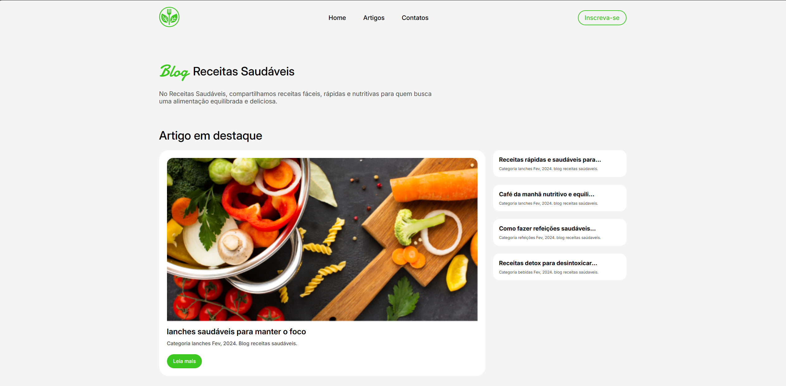

<h1 align="center">
  Blog Receitas Saudáveis
</h1>

  

## 💻 Projeto

Este projeto é um atividade do meu curso fullstack do +PraTI utilizando _HTML_ e _CSS_.

## 🚀 Tecnologias

- HTML
- CSS

## 📔 Conhecimentos Abordados

- [x] Uso semântico do HTML
- [x] Utilização de CSS grid
- [x] Uso do CSS Flexbox
- [x] Efeitos com a propriedade `transform` do css
